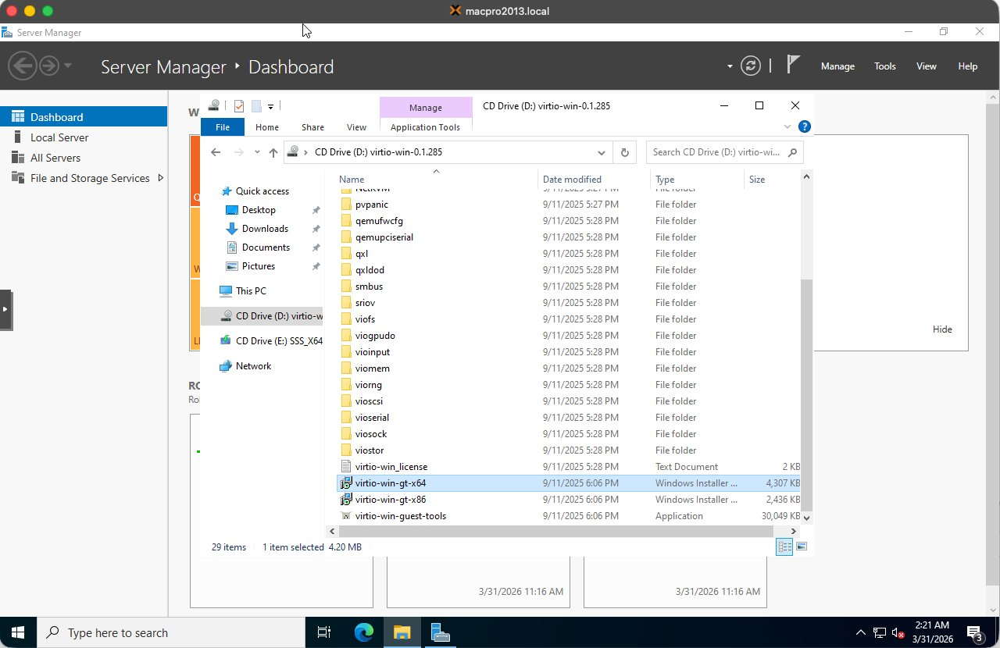
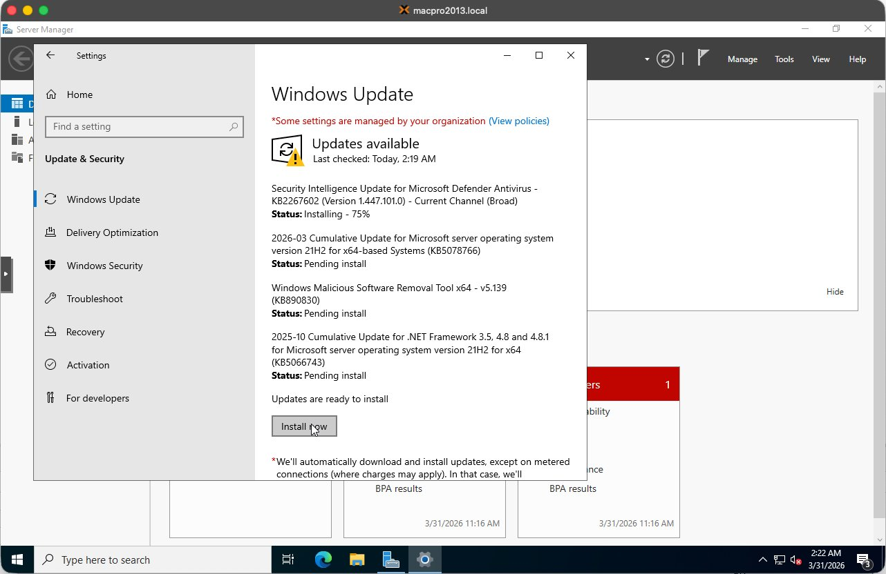
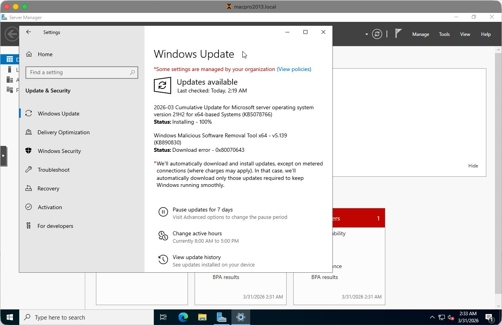
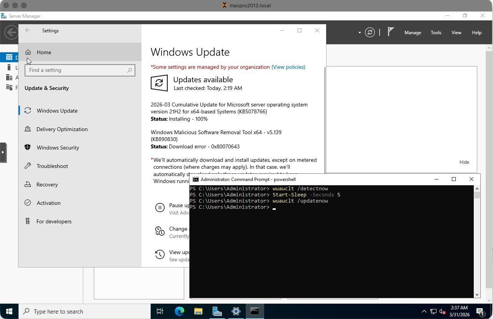
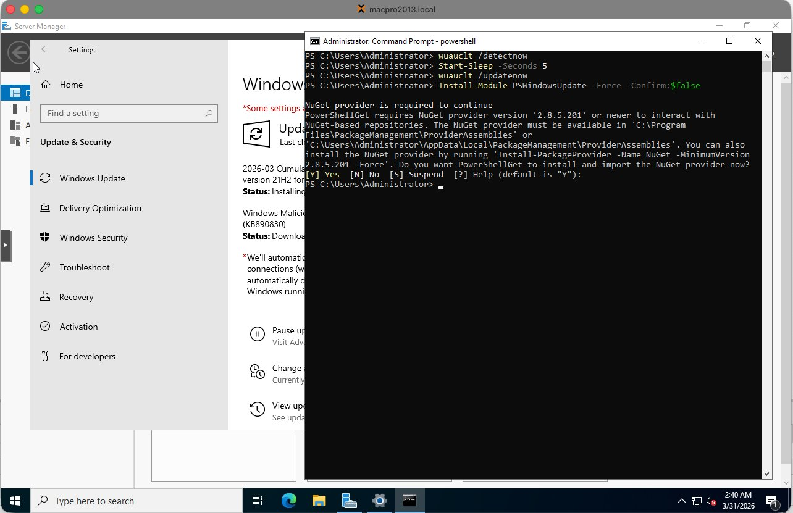
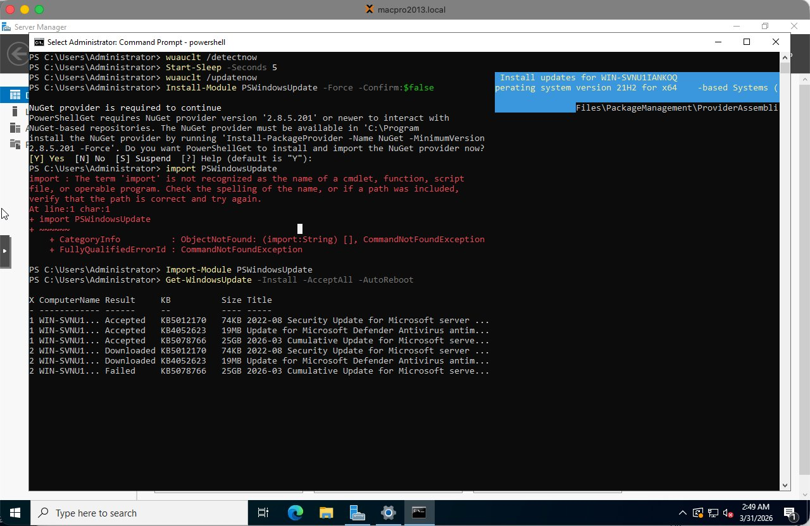
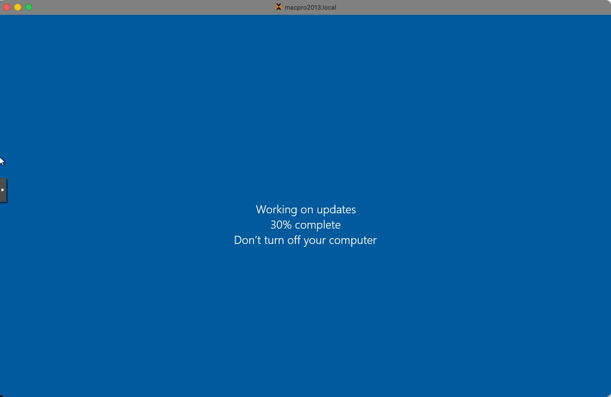
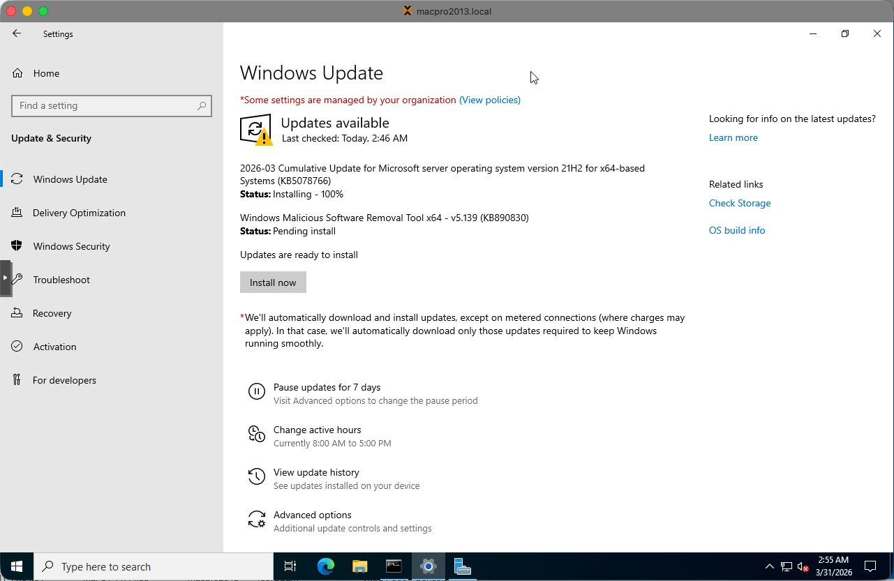
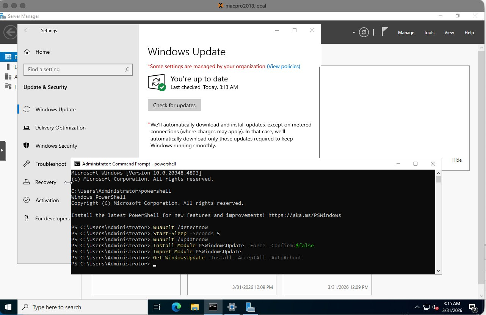
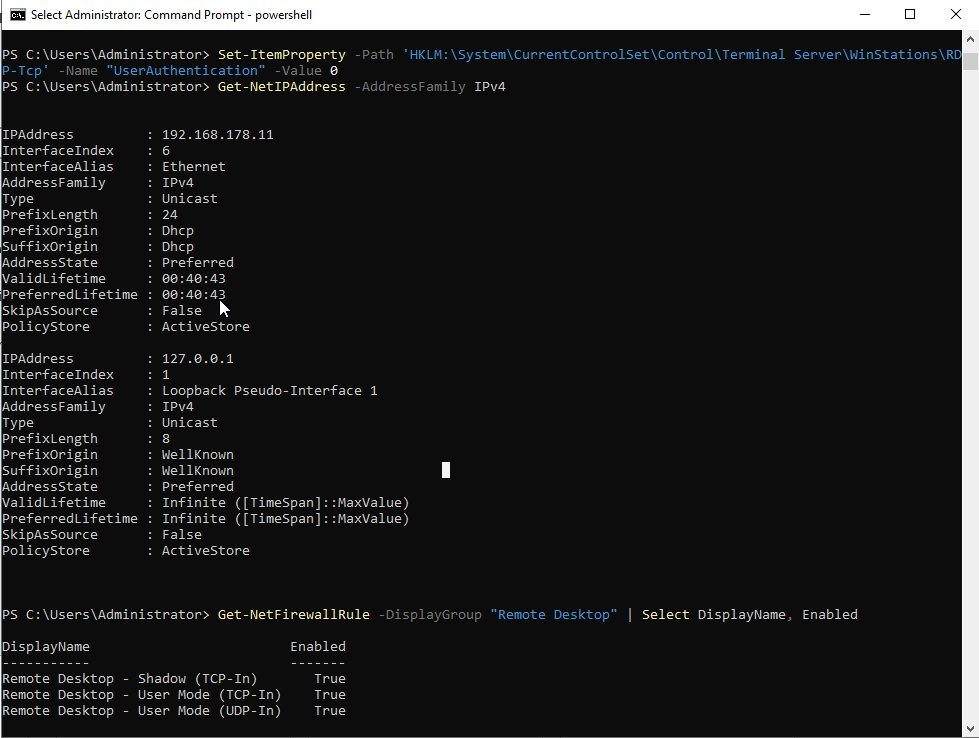

Dit is deel 2 van de serie over het opbouwen van een Windows DevOps lab in Proxmox. In [deel 1](/blog/2026-proxmox-windows-server-2022-vm-aanmaken/) heb ik beschreven hoe je de VM aanmaakt. In dit artikel bereid ik de VM voor als herbruikbare Proxmox template. Alle toekomstige VMs — de CA server, member servers en andere rollen — worden vanuit deze template gekloond.

> **Download de volledige handleiding met screenshots (.docx):**
> [WS2022-in-Proxmox-Template-Preparation-Guide-NL.docx](WS2022-in-Proxmox-Template-Preparation-Guide-NL.docx)

> **Belangrijk:** Start de VM na Sysprep **nooit** opnieuw op. Als je dat doet wordt de generalisatie verbruikt en moet de template opnieuw worden opgebouwd.

---

## Overzicht van de stappen

1. VirtIO guest drivers installeren
2. Windows Update — OS volledig patchen
3. Prestatie-optimalisaties toepassen
4. Basisinstellingen — tijdzone, RDP, IE Enhanced Security
5. Sysprep — generaliseren en afsluiten
6. Converteren naar template in Proxmox

---

## Stap 1 — VirtIO guest drivers installeren

Windows Server 2022 heeft VirtIO drivers nodig om correct te functioneren op Proxmox. Ze dekken de storage controller, netwerkadapter, memory ballooning, display en andere paravirtualized apparaten.

Open Verkenner in de VM en navigeer naar het VirtIO CD station (D: of E:). Scroll naar beneden in de bestandslijst:


*VirtIO CD station inhoud — virtio-win-guest-tools.exe staat onderaan de lijst (30MB Application)*

Dubbelklik op **virtio-win-guest-tools.exe** (de Application, ongeveer 30MB). Deze installeert alle benodigde drivers in één keer. Accepteer de standaardinstellingen en wacht tot de installatie klaar is.

> **Tip:** Gebruik altijd `virtio-win-guest-tools.exe` in plaats van individuele drivers uit de submappen. Het is sneller en garandeert dat niets wordt overgeslagen.

---

## Stap 2 — Windows Update

Het OS volledig patchen vóór Sysprep zorgt ervoor dat elke gekloonde VM al up-to-date start zonder individueel updates te hoeven draaien.

### 2.1 Windows Update starten

Open **Instellingen → Update & Security → Windows Update** en klik op Check for updates. Beschikbare updates beginnen te downloaden en installeren:


*Windows Update downloadt en installeert meerdere updates — laat dit rustig draaien*

### 2.2 Bekend probleem — Windows Update GUI loopt vast

De Windows Update GUI in Server 2022 VMs is onbetrouwbaar. Knoppen reageren regelmatig niet meer en downloads lijken te hangen. Dit is een bekend probleem in VM omgevingen.


*Windows Update GUI met Install Now knop die niet reageert — schakel over naar PowerShell*

> **Let op:** Wanneer de Windows Update GUI vastloopt, probeer dit **niet** via de GUI op te lossen. Gebruik in plaats daarvan de PowerShell methode hieronder.

### 2.3 Aanbevolen methode — PSWindowsUpdate via PowerShell

Open PowerShell als Administrator (rechtsklik Start → Windows PowerShell (Admin)):


*PowerShell (Admin) open en gereed*

**Stap 1 — Installeer de PSWindowsUpdate module:**

```powershell
Install-Module PSWindowsUpdate -Force -Confirm:$false
```


*PSWindowsUpdate module installeert — typ Y als er gevraagd wordt om de NuGet provider te installeren of PSGallery te vertrouwen*

Typ **Y** en druk op Enter als er gevraagd wordt om de NuGet provider te installeren of PSGallery te vertrouwen.

**Stap 2 — Importeer de module en installeer alle updates:**

```powershell
Import-Module PSWindowsUpdate
Get-WindowsUpdate -Install -AcceptAll -AutoReboot
```


*PSWindowsUpdate in uitvoering — toont status per KB artikel*

De VM herstart automatisch als dat nodig is. Tijdens de herstart worden updates toegepast:


*Windows past updates toe tijdens herstart — onderbreek dit niet*

Na de herstart, log opnieuw in en voer het commando nogmaals uit totdat er geen updates meer zijn:

```powershell
Get-WindowsUpdate -Install -AcceptAll -AutoReboot
```


*Windows Update toont "You're up to date" na de eerste ronde*

Voer Windows Update een tweede keer uit om te bevestigen dat er niets gemist is. Sommige updates worden pas beschikbaar nadat andere zijn geïnstalleerd:


*Windows Update bevestigd up to date na tweede controle — OS is volledig gepatcht*

> **Opmerking:** Sommige updates (zoals KB890830 — Windows Malicious Software Removal Tool) mislukken soms persistent in VM omgevingen. Dit is bekend en onschadelijk — het heeft geen invloed op de serverfunctionaliteit en kan veilig worden overgeslagen.

---

## Stap 3 — Prestatie-optimalisaties

Voer deze aanpassingen uit in PowerShell (Admin) vóór Sysprep zodat elke gekloonde VM er automatisch van profiteert:

```powershell
# Hoog prestatieniveau energieplan instellen
powercfg /setactive 8c5e7fda-e8bf-4a96-9a85-a6e23a8c635c

# Windows Search indexering uitschakelen — niet nodig op servers
Set-Service WSearch -StartupType Disabled
Stop-Service WSearch -Force

# SysMain / Superfetch uitschakelen — niet nuttig in VMs
Set-Service SysMain -StartupType Disabled
Stop-Service SysMain -Force
```

> **Tip:** Wijzig ook de VM Display van Default naar **VirtIO-GPU** in de Proxmox Hardware tab. Dit verbetert de console responsiviteit aanzienlijk.

---

## Stap 4 — Basisinstellingen

Voer deze commando's uit in PowerShell (Admin):

```powershell
# Tijdzone instellen op Amsterdam
Set-TimeZone -Name "W. Europe Standard Time"

# RDP inschakelen
Set-ItemProperty -Path 'HKLM:\System\CurrentControlSet\Control\Terminal Server' `
  -Name "fDenyTSConnections" -Value 0
Enable-NetFirewallRule -DisplayGroup "Remote Desktop"

# NLA uitschakelen voor eenvoudiger lab toegang
Set-ItemProperty -Path 'HKLM:\System\CurrentControlSet\Control\Terminal Server\WinStations\RDP-Tcp' `
  -Name "UserAuthentication" -Value 0

# IE Enhanced Security Configuration uitschakelen
$AdminKey = "HKLM:\SOFTWARE\Microsoft\Active Setup\Installed Components\{A509B1A7-37EF-4b3f-8CFC-4F3A74704073}"
$UserKey  = "HKLM:\SOFTWARE\Microsoft\Active Setup\Installed Components\{A509B1A8-37EF-4b3f-8CFC-4F3A74704073}"
Set-ItemProperty -Path $AdminKey -Name "IsInstalled" -Value 0
Set-ItemProperty -Path $UserKey  -Name "IsInstalled" -Value 0
```

> **Let op:** Na het inschakelen van RDP via het register is een herstart nodig voordat poort 3389 begint te luisteren. Voer `Restart-Computer` uit en wacht tot de VM terug is.

### RDP verbinding verifiëren

Na de herstart verifieer je RDP via de Proxmox host shell:


*Ping succesvol en nc -zv bevestigt poort 3389 open — RDP werkt correct. Get-NetFirewallRule toont alle Remote Desktop regels als Enabled: True*

De screenshot toont:
- `ping 192.168.178.11` — reageert met 0% packet loss, netwerk werkt
- `nc -zv 192.168.178.11 3389` — poort open, RDP luistert
- `Get-NetFirewallRule` — alle Remote Desktop firewall regels tonen `Enabled: True`

> **Tip:** Als nc "Connection refused" toont na het inschakelen van RDP, is een herstart nodig. RDP begint pas te luisteren na een herstart.

---

## Stap 5 — Sysprep

Sysprep generaliseert de installatie door alle machine-specifieke identificatoren te verwijderen, inclusief de Security Identifier (SID), computernaam en hardware referenties. Dit is essentieel — zonder Sysprep zou elke gekloonde VM dezelfde SID hebben, wat Active Directory conflicten veroorzaakt.

> **Dit is het punt van geen terugkeer.** Na Sysprep sluit de VM zichzelf af. Start de VM daarna **nooit** opnieuw op. Ga direct naar Proxmox en converteer hem naar een template.

Voer uit in PowerShell (Admin) of de Opdrachtprompt:

```cmd
C:\Windows\System32\Sysprep\sysprep.exe /oobe /generalize /shutdown
```

| Vlag | Doel |
| --- | --- |
| /generalize | Verwijdert unieke systeem-ID's — SID, computernaam, hardware ID's |
| /oobe | Configureert Windows om bij de volgende start first-time setup te draaien |
| /shutdown | Sluit de VM automatisch af na voltooiing |

Sysprep duurt ongeveer 2-5 minuten. De VM sluit zichzelf af wanneer klaar.

---

## Stap 6 — Converteren naar template in Proxmox

Zodra de VM zichzelf heeft afgesloten na Sysprep, in het Proxmox linker paneel:

1. **Rechtsklik** op de VM (bijv. 900 WS2022-TEMPLATE-BASE)
2. Selecteer **Convert to template**
3. Bevestig de actie

Het VM icoon verandert naar een template icoon (gestapelde pagina's). De VM kan niet meer direct worden gestart — alleen gekloond.

### Template klonen voor nieuwe VMs

Om een nieuwe VM vanuit de template te maken:

1. Rechtsklik op de template in het Proxmox linker paneel
2. Selecteer **Clone**
3. Stel Mode in op **Full Clone** — niet Linked Clone
4. Voer de nieuwe VM naam in volgens de naamgevingsconventie (bijv. WS2022-LAB02-CA)
5. Stel het VM ID in
6. Klik **Clone**

> **Let op:** Gebruik altijd Full Clone. Linked clones zijn afhankelijk van de template schijf en kunnen niet zelfstandig functioneren. Full clones zijn volledig onafhankelijke VMs.

Na het klonen start de nieuwe VM op in Windows OOBE (first-time setup) waar je het Administrator wachtwoord, de computernaam en netwerkinstellingen configureert voordat je het domein kunt joinen.

---

## Samenvatting checklist

| # | Taak | Gereed |
| --- | --- | --- |
| 1 | virtio-win-guest-tools.exe installeren vanaf VirtIO CD station | ☐ |
| 2 | PSWindowsUpdate uitvoeren tot volledig gepatcht — herhaal na elke herstart | ☐ |
| 3 | Hoog prestatieniveau energieplan instellen via powercfg | ☐ |
| 3 | WSearch en SysMain services uitschakelen | ☐ |
| 3 | Proxmox Display wijzigen naar VirtIO-GPU in Hardware tab | ☐ |
| 4 | Tijdzone instellen op W. Europe Standard Time | ☐ |
| 4 | RDP inschakelen en NLA uitschakelen | ☐ |
| 4 | IE Enhanced Security Configuration uitschakelen | ☐ |
| 4 | Herstart en RDP op poort 3389 verifiëren via nc | ☐ |
| 5 | Sysprep uitvoeren: /oobe /generalize /shutdown | ☐ |
| 6 | VM direct na afsluiten converteren naar template in Proxmox | ☐ |
