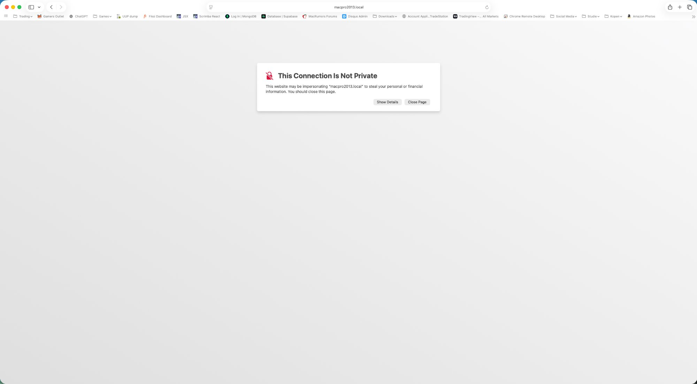
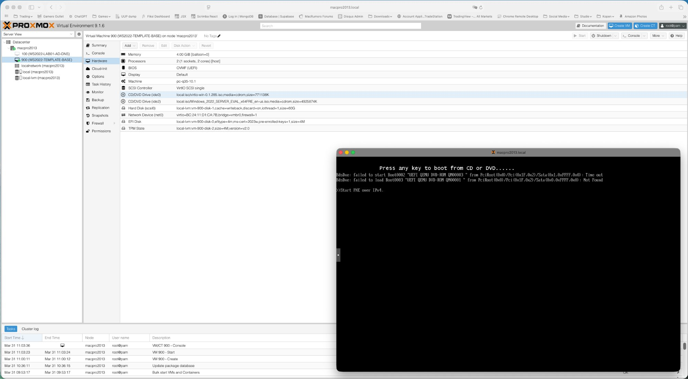
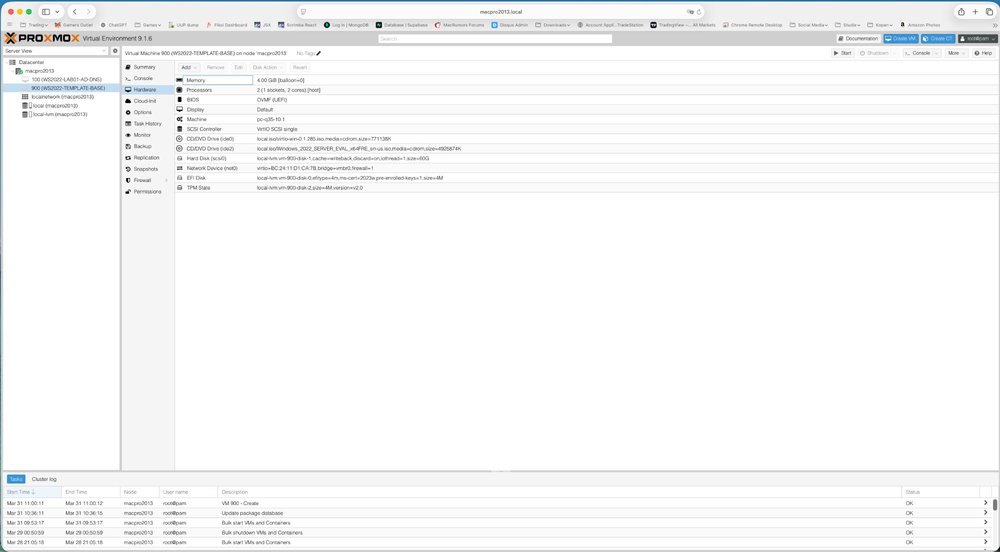
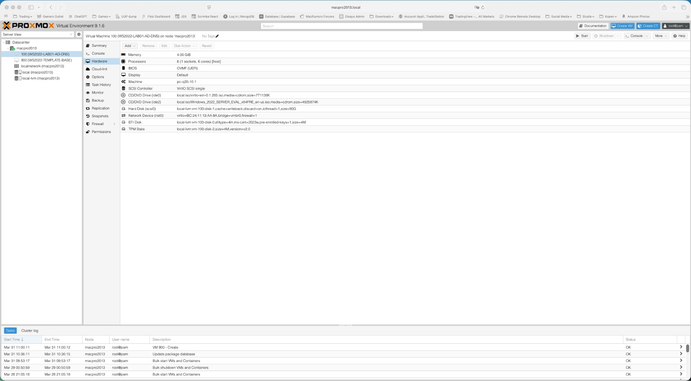
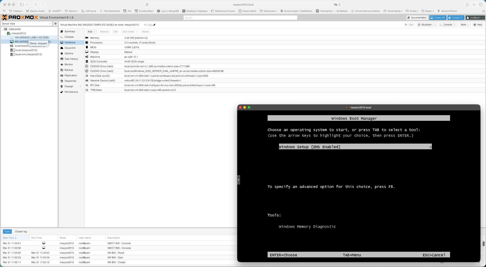
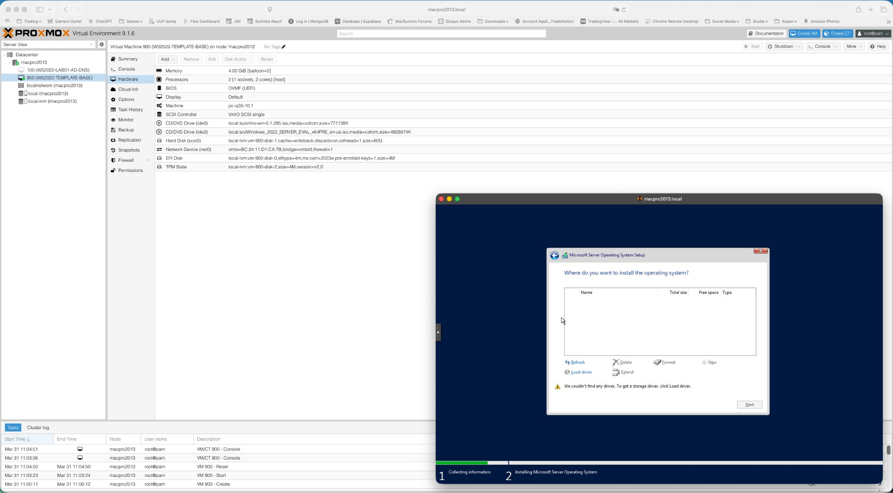
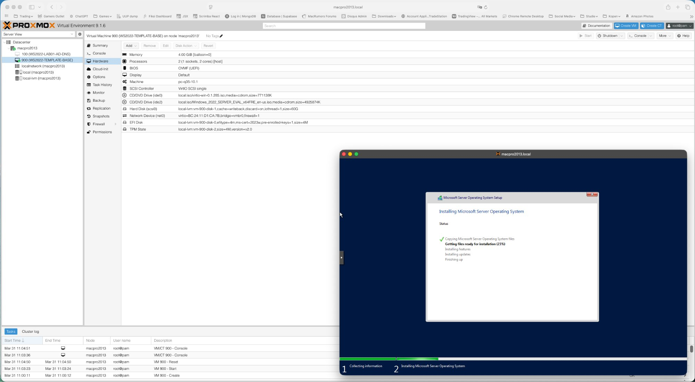
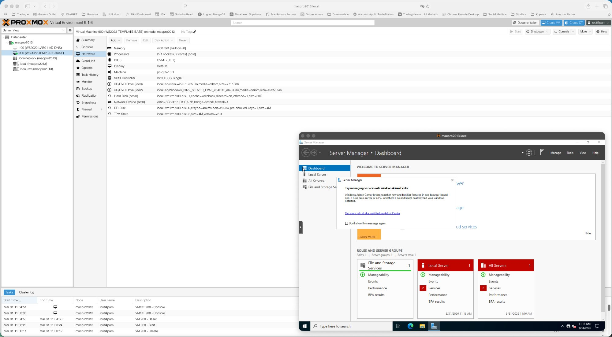

In dit artikel beschrijf ik stap voor stap hoe ik een Windows Server 2022 VM aanmaak in Proxmox VE 9.1.6. De handleiding is gebaseerd op praktijkervaring en bevat alle correcties en lessen die ik onderweg heb opgedaan. Dit is deel 1 van een serie over het opbouwen van een volledig Windows DevOps lab in Proxmox.

> **Download de volledige handleiding met screenshots (.docx):**
> [WS2022-in-Proxmox-VM-Creation-Guide-NL.docx](WS2022-in-Proxmox-VM-Creation-Guide-NL.docx)

## Laboratoriumomgeving

| Onderdeel | Waarde |
| --- | --- |
| Proxmox host | macpro2013.local — Mac Pro 2013 Trashcan |
| Proxmox versie | 9.1.6 |
| RAM | 128 GB |
| Opslag | 3.6 TB NVMe (local-lvm pool) |
| Netwerkbridge | vmbr0 — intern lab netwerk (192.168.178.x) |
| Proxmox WebUI | https://192.168.178.205:8006 |

---

## Waarom een CA nodig is — de SSL waarschuwing

Wie de Proxmox WebUI via `macpro2013.local` opent in Safari krijgt meteen een certificaatwaarschuwing. Proxmox gebruikt standaard een zelfondertekend certificaat.


*Safari toont een SSL waarschuwing voor macpro2013.local — dit wordt opgelost zodra de Certificate Authority is ingericht*

Dit is precies de motivatie om later een interne Certificate Authority (CA) op te zetten. Zodra die draait kan Proxmox een vertrouwd certificaat krijgen en verdwijnt de waarschuwing.

---

## Vereisten

Zorg dat de volgende ISO bestanden beschikbaar zijn in de Proxmox local opslag (Proxmox WebUI → local → ISO Images):

- **Windows Server 2022 Evaluation:** `Windows_2022_SERVER_EVAL_x64FRE_en-us.iso`
- **VirtIO drivers:** `virtio-win-0.1.285.iso` of nieuwer

> **Let op:** Beide ISO's zijn vereist. Zonder de VirtIO ISO kan Windows Setup de schijf en netwerkkaart niet detecteren.

---

## Naamgeving van VMs

Gebruik consistente namen die de OS versie én alle actieve rollen bevatten. Zo zie je in één oogopslag wat elke VM doet in het Proxmox paneel.

| Patroon | Voorbeeld | Beschrijving |
| --- | --- | --- |
| WS2022-LAB{nn}-{ROLLEN} | WS2022-LAB01-AD-DNS | Lab VM met alle actieve rollen in de naam |
| WS2022-LAB{nn}-CA | WS2022-LAB02-CA | Certificate Authority VM |
| WS2022-TEMPLATE-{NAAM} | WS2022-TEMPLATE-BASE | Template VM — gebruik VM ID 900+ |

Een VM hernoemen gaat via de Proxmox host shell (de WebUI heeft geen rename optie):

```bash
ssh root@macpro2013.local
qm set <VMID> --name <NIEUWE-NAAM>

# Voorbeeld:
qm set 100 --name WS2022-LAB01-AD-DNS
```

Hieronder zie je hoe het Proxmox paneel eruitziet nadat beide VMs correct zijn aangemaakt en hernoemd:


*Proxmox paneel met WS2022-LAB01-AD-DNS (VM 100) en WS2022-TEMPLATE-BASE (VM 900) correct aangemaakt*

---

## VM aanmaken — de Proxmox wizard

Klik op **Create VM** (blauwe knop rechtsboven) en doorloop alle tabbladen zoals hieronder beschreven.

### General tabblad

| Instelling | Waarde | Toelichting |
| --- | --- | --- |
| Name | WS2022-TEMPLATE-BASE | Beschrijvende naam inclusief OS en rol |
| VM ID | 900 | Gebruik 900+ voor templates, 100+ voor lab VMs |
| Node | macpro2013 | Jouw Proxmox host |

### OS tabblad

| Instelling | Waarde | Toelichting |
| --- | --- | --- |
| ISO Image | Windows_2022_SERVER_EVAL_x64FRE_en-us.iso | Selecteer uit local opslag |
| Type | Microsoft Windows | **Moet expliciet worden ingesteld** |
| Version | 11/2022/2025 | **Moet expliciet worden ingesteld** |
| Add VirtIO drivers ISO | Ingeschakeld (checkbox) | Voegt een tweede CD drive toe voor VirtIO ISO |
| VirtIO ISO | virtio-win-0.1.285.iso | Selecteer uit local opslag |

> **Let op:** Type en Version moeten allebei handmatig worden ingesteld. De checkbox voor de VirtIO ISO voegt een tweede CD drive toe — dit is essentieel voor het laden van storage en netwerk drivers tijdens Windows Setup.

### System tabblad

| Instelling | Waarde | Toelichting |
| --- | --- | --- |
| BIOS | OVMF (UEFI) | Vereist voor Windows Server 2022 |
| Machine | pc-q35 | Moderne chipset vereist voor TPM 2.0 |
| SCSI Controller | VirtIO SCSI single | Beste storage prestaties |
| EFI Storage | local-lvm | **Moet expliciet worden geselecteerd — geen standaard** |
| TPM Storage | local-lvm | **Moet expliciet worden geselecteerd — geen standaard** |
| TPM Version | v2.0 | Vereist voor Windows Server 2022 |

> **Let op:** EFI Storage en TPM Storage hebben geen standaardwaarde — beide moeten expliciet worden geselecteerd. Zonder deze instellingen start de VM niet correct op.

### Disks tabblad

| Instelling | Waarde | Toelichting |
| --- | --- | --- |
| Bus/Device | SCSI | Gebruik samen met VirtIO SCSI controller |
| Storage | local-lvm | NVMe-backed pool |
| Disk Size | 60 GB | Voldoende voor OS, rollen en tools |
| Cache | Write back | Beste prestaties op NVMe |
| Discard | Ingeschakeld | Activeert TRIM voor SSD/NVMe opslag |
| IO Thread | Ingeschakeld | Verbetert schijfdoorvoer |

### CPU tabblad

| Instelling | Waarde | Toelichting |
| --- | --- | --- |
| Sockets | 1 | Enkele socket |
| Cores | 2 | Voldoende voor alle lab VM rollen |
| Type | **host** | Geeft de echte host CPU door — betere prestaties dan de standaard kvm64 |

> **Let op:** CPU Type moet worden ingesteld op `host`. De standaard `kvm64` beperkt beschikbare CPU instructieset functies en verlaagt de prestaties.

### Memory tabblad

| Instelling | Waarde | Toelichting |
| --- | --- | --- |
| Memory | 4096 MB | 4GB per VM |
| Minimum Memory | 4096 MB | Zet gelijk aan Memory om ballooning uit te schakelen |
| Ballooning Device | Uitgeschakeld | Wordt niet goed ondersteund op Windows |

> **Let op:** Ballooning moet worden uitgeschakeld voor Windows VMs. Zet Minimum Memory gelijk aan Memory. In het hardware overzicht zie je dit terug als `[balloon=0]`.

### Network tabblad

| Instelling | Waarde | Toelichting |
| --- | --- | --- |
| Bridge | vmbr0 | Intern lab netwerk |
| Model | VirtIO (paravirtualized) | Beste prestaties — vereist VirtIO drivers |
| Firewall | Ingeschakeld (standaard laten) | Laat ingeschakeld — spiegelt productie en bouwt troubleshooting vaardigheden |

> **Let op:** Laat de Proxmox firewall ingeschakeld op de netwerkadapter. Uitschakelen lijkt handig maar verwijdert een belangrijke laag die echte productieomgevingen weerspiegelt. Troubleshooten door de firewall heen is een waardevolle vaardigheid.

---

## Hardware verificatie vóór eerste start

Na het klikken op Finish, start de VM **nog niet**. Klik eerst op de VM in het linker paneel en selecteer **Hardware**. Controleer dat alle instellingen overeenkomen met bovenstaande tabellen.


*VM 900 (WS2022-TEMPLATE-BASE) — Hardware tabblad met correcte configuratie. Let op balloon=0, host CPU type, beide ISO's aanwezig, 60G schijf met writeback/discard/iothread, EFI en TPM aanwezig.*

Controleer specifiek:

- Memory: `4.00 GiB [balloon=0]` — balloon=0 bevestigt dat ballooning uit staat
- Processors: `2 (1 socket, 2 cores) [host]` — bevestigt host CPU type
- BIOS: `OVMF (UEFI)`
- Machine: `pc-q35`
- SCSI Controller: `VirtIO SCSI single`
- CD/DVD ide0: virtio-win ISO aanwezig
- CD/DVD ide2: Windows 2022 ISO aanwezig
- Hard Disk: 60G, `cache=writeback`, `discard=on`, `iothread=1`
- Network: `vmbr0`, `firewall=1`
- EFI Disk en TPM State aanwezig op local-lvm

---

## VM opstarten en Windows boot

Klik op **Start** en open direct de **Console**. Zodra je het volgende ziet, klik je eerst in het console venster (om toetsenbordinvoer te vangen) en druk je op een willekeurige toets:

```
Press any key to boot from CD or DVD......
```

> **Let op:** Als je te laat bent start de VM door naar PXE boot zoals hieronder. Reset de VM dan gewoon en probeer het opnieuw — wees klaar bij de console vóórdat je op Start klikt.


*PXE boot fallback wanneer de CD boot prompt gemist werd — reset de VM en probeer opnieuw*

Als je het prompt op tijd haalt verschijnt de Windows Boot Manager:


*Windows Boot Manager — selecteer Windows Setup [EMS Enabled] en druk op Enter*

Selecteer **Windows Setup [EMS Enabled]** (staat al geselecteerd) en druk op Enter.

---

## Editie selectie

Kies bij de editieselectie:

**Windows Server 2022 Datacenter (Desktop Experience)**

> **Let op:** Selecteer Datacenter, niet Standard. En Desktop Experience, niet Core. Core heeft geen GUI en is daarvoor ongeschikt voor deze lab template.

---

## VirtIO storage driver laden

Op het scherm "Where do you want to install the operating system?" is de schijflijst leeg. Dit is normaal — Windows kan de VirtIO SCSI schijf niet zien zonder de driver.


*Windows Setup toont geen schijf — VirtIO SCSI driver moet eerst worden geladen*

Stappen om de driver te laden:

1. Klik op **Load driver**
2. Klik op **Browse**
3. Navigeer naar het VirtIO CD station (D: of E:)
4. Open de map: `vioscsi \ w2k22 \ amd64`
5. Klik **OK**
6. Selecteer **Red Hat VirtIO SCSI pass-through controller**
7. Klik **Next**

De 60GB schijf verschijnt nu in de lijst. Selecteer deze en ga verder. De Windows installatie start:


*Windows Server 2022 installatie in uitvoering — 23% bezig*

---

## Na de installatie — Server Manager

Na de installatie en herstart land je op het Server Manager Dashboard. Sluit de Windows Admin Center melding (vink "Don't show this message again" aan):


*Server Manager Dashboard — Windows Server 2022 Datacenter succesvol geïnstalleerd*

De VM is nu klaar voor de volgende stap: template voorbereiding zoals beschreven in deel 2 van deze serie.

---

## Samenvatting checklist

| # | Taak | Gereed |
| --- | --- | --- |
| 1 | Windows Server 2022 ISO uploaden naar Proxmox local opslag | ☐ |
| 2 | VirtIO drivers ISO uploaden naar Proxmox local opslag | ☐ |
| 3 | VM aanmaken met correcte instellingen in alle wizard tabbladen | ☐ |
| 4 | Hardware configuratie verifiëren in Proxmox Hardware tab vóór start | ☐ |
| 5 | VM opstarten — CD boot prompt direct opvangen in Console | ☐ |
| 6 | Windows Server 2022 Datacenter (Desktop Experience) selecteren | ☐ |
| 7 | VirtIO SCSI driver laden (vioscsi/w2k22/amd64) vóór schijfselectie | ☐ |
| 8 | Windows installatie voltooien | ☐ |
| 9 | Verder naar deel 2 — Template Voorbereiding | ☐ |
